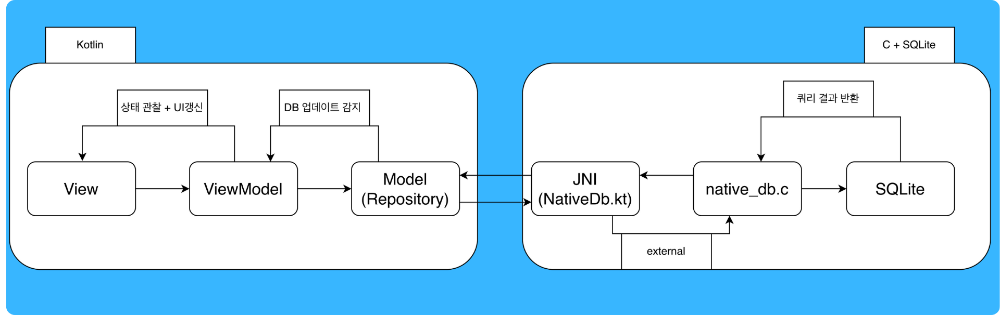
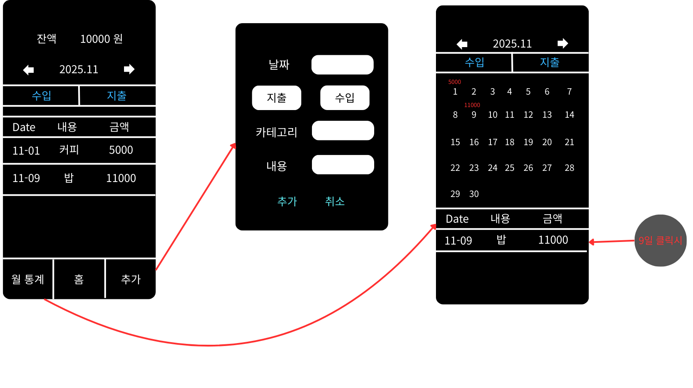
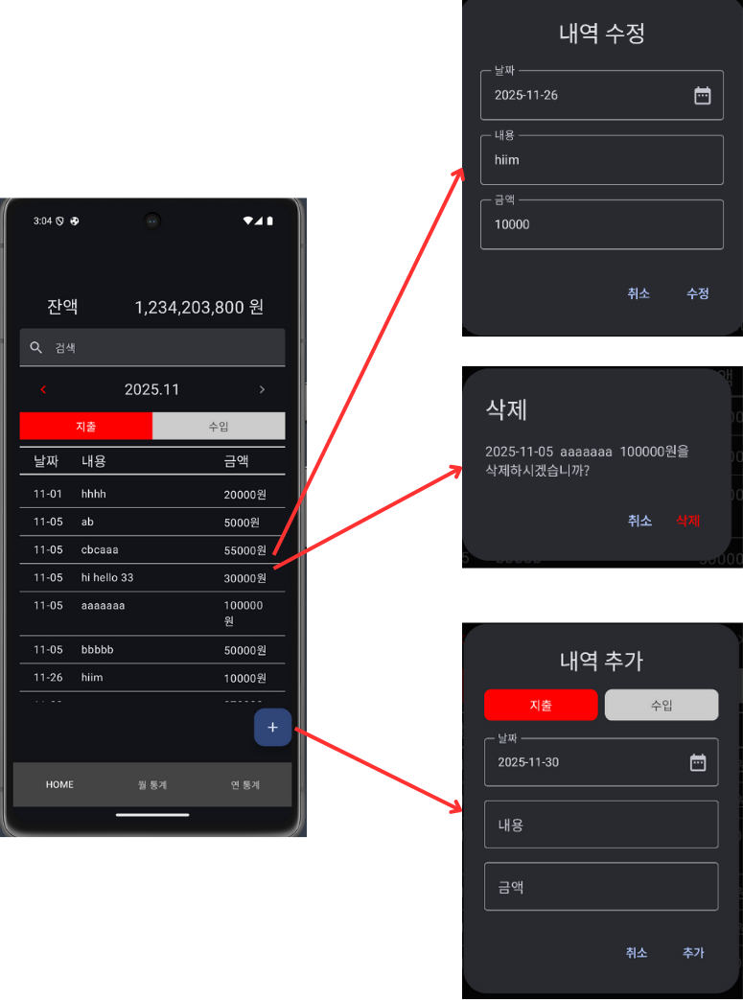
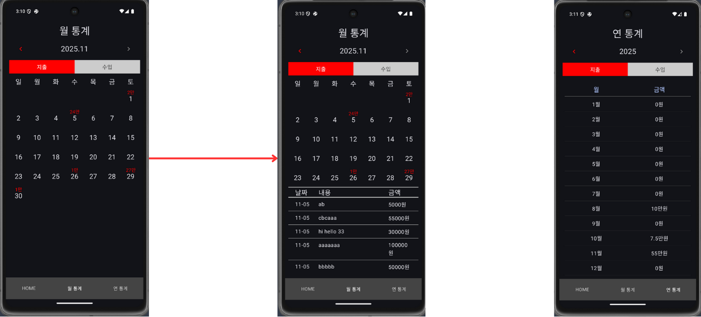

<h1 style="color:blue">Allowance Management App</h1>

간단하고 직관적인 UI 기반의 지출/수입 관리 앱으로, 월/연 단위 통계를 제공하는 Android 용돈 관리 앱입니다.

  

<h2 style="color:blue">목차</h2>
<h3> 1) 주요 기능 </h3> 
<h3> 2) 전체 아키텍쳐</h3>
<h3> 3) UI 소개 </h3>
<h3> 4) 설계시 고민 사항</h3>

   

<h2 style="color:blue">1) 주요 기능</h2>

- 지출 / 수입 내역 추가, 수정, 삭제
- 월별·연별 통계 제공
- 캘린더 기반 일자별 상세 내역 확인
- 검색 기능 지원
- Amalgamation 기반 SQLite 사용

   

<h2 style="color:blue">2) MVVM 아키텍쳐</h2>

   

<h2 style="color:blue">3) UI 소개</h2>

<h2 style="color:skyblue">초기 와이어프레임</h2>

  
<h2 style="color:skyblue">실제 HomeView</h2>

<h3 style="color:skyblue">1) 데이터 추가 흐름</h3>

- 오른쪽 아래 + 버튼클릭
- '내역 추가' 다이얼로그에서 데이터 입력
- '추가'버튼 클릭 -> 데이터 생성

**다이얼로그 -> ViewModel(addExpense, addIncome) -> HomeRepository -> JNI -> SQLite INSERT**

 

<h3 style="color:skyblue">2) 데이터 수정 흐름</h3>

- 리스트에서 특정 항목 탭
- '내역 수정' 다이얼로그 표시
- 데이터 수정 후 '수정' 버튼 클릭

**다이얼로그 -> ViewModel(updateExpense, updateIncome) -> HomeRepository -> JNI -> SQLite UPDATE**

 

<h3 style="color:skyblue">3) 데이터 삭제 흐름</h3>

- 리스트 항목 길게 누름
- 삭제 확인 다이얼로그 표시
- '삭제' 클릭 시 해당 항목 제거

**길게 누름 -> delete 다이얼로그 -> ViewModel(deleteExpense, deleteIncome) -> HomeRepository -> JNI -> SQLite DELETE**

 

<h3 style="color:skyblue">4) SearchBar 기능</h3>

- 엔터 없이 즉시 필터링

**TextField 입력 -> ViewModel.updateSearchQuery -> HomeRepository ->
JNI -> SQLite SELECT**

 

<h3 style="color:skyblue">5) 잔액</h3>

- 잔액 = 총 수입 - 총 지출
- SQLite에서 SUM으로 계산 후 전달 받음

**ViewModel.updateBalance -> HomeRepository.getBalance -> JNI -> SQLite SELECT SUM**

  
<h2 style="color:skyblue">StatsView들</h2>

<h3 style="color:skyblue">1) 월 통계</h3>

- 사용자가 선택한 연/월 지출-수입 내역을 달력 형태로 시각화
- 각 날짜 칸에는 해당 일의 총 금액이 표시
- 이 금액은 viewModel에서 getDailySum 호출 -> SQLite에서 GROUP BY로 집계해서 가져옴
- 날짜를 터치하면 Home 화면과 동일하게 해당 날짜의 상세 내역 리스트가 표시

<h3 style="color:skyblue">2) 연 통계</h3>

- 사용자가 선택한 연도의 월별 총 지출-수입 합계를 리스트로 제공
- 연 단위로 재정 흐름을 쉽게 파악할 수 있도록 설계
- 월별 합계는 viewModel에서 getMonthSum 호출 -> SQLite에서 GROUP BY로 집계해서 가져옴

   

<h2 style="color:skyblue">4) 설계시 고민 사항</h2>

### (1) 무거워진 ViewModel

🔶 Before — 단일 ViewModel 구조의 문제

초기 설계에서는 앱의 모든 상태와 로직을 하나의 ViewModel에서 관리하는 것을 고려했습니다. 하지만 이 방식은 다음과 같은 문제가 있었습니다.

- 홈 / 월 통계 / 연 통계 화면이 모두 하나의 ViewModel
- SRP 위반
- MonthStats에서 변경한 년/월이 Home 화면에서도 반영되는 문제
- 유지보수성 저하 + 가독성 하락

 
🔷 After — 화면 단위 ViewModel로 분리

- 화면마다 하나의 ViewModel로 분리
- Model은 하나만 유지하여 세개의 ViewModel이 동일한 DB를 공유하도록 설계
- -> SRP 만족, 유지보수성 상승

 

### (2) 중복되는 함수 문제

🔶 Before — 지출/수입 함수 중복

- HomeViewModel과 HomeRepository에서 지출과 수입을 처리하는 함수들에서 유사한 코드 패턴이 반복 (ex : addExpense/addIncome)
- addExpense와 addIncome은 type(지출 = 0, tndlq = 1)만 다르고 내부 로직은 동일

 
🔷 After — 중복 제거 고민 → 현 구조 유지

 

처음엔 addActivity, updateActivity, deleteActivity와 같은 단일 함수로 추상화를 고민했습니다.

- 장점 :
  - 코드 중복 제거
  - 로직 통일
- 단점 :
  - 지출/수입 두개뿐이라 추상화 이득이 크지 않았음
  - 오히려 가독성이 떨어짐

-> 결론적으로 현재의 구조를 유지

 

### (3) SQL 보안 관련

🔶 Before — 사용자 입력 기반 SQL 처리의 위험

이 앱은 사용자의 입력을 받아 SQL을 처리하므로 SQL 인젝션 공격에 대한 방어를 고려해야 했습니다.

 

🔷 After — sqlite3_prepare 사용한 안전한 쿼리 처리

SQL 명령과 데이터를 분리하기 위해

1. sqlite3_prepare_v2로 ?가 포함된 SQL을 미리 컴파일
2. sqlite3_bind_text 등으로 데이터 바인딩
3. SQL 문자열을 직접 합치지 않도록 설계

-> 사용자 입력이 SQL 명령으로 바로 전달되지 않음

 

### (4) JNI를 통한 Kotlin과 C기반 SQLITE 연동

🔶 Before — Room 없이 순수 SQLite + JNI로 직접 구현

Room 대신 C 기반 SQLite를 사용해야 했고 Kotlin과 C 사이에서 데이터를 주고받는 과정

 

🔷 After — 자료형별 명확한 데이터 변환 규칙 정의

1. Kotlin -> C

- Int, String으로 전달하여 C에서 변수로 활용

 

2. C -> Kotlin

- Int 반환 : Sum을 통한 금액 반환 같은 단순 값은 바로 반환
- 배열 반환 : 일별/월별 합계는 jintArray로 반환 (ex : [1(일), 50000])
- 객체 리스트 반환 : ArrayList<ActivityUI>를 직접 생성해서 Kotlin에서 바로 활용할 수 있도록 구현

 
